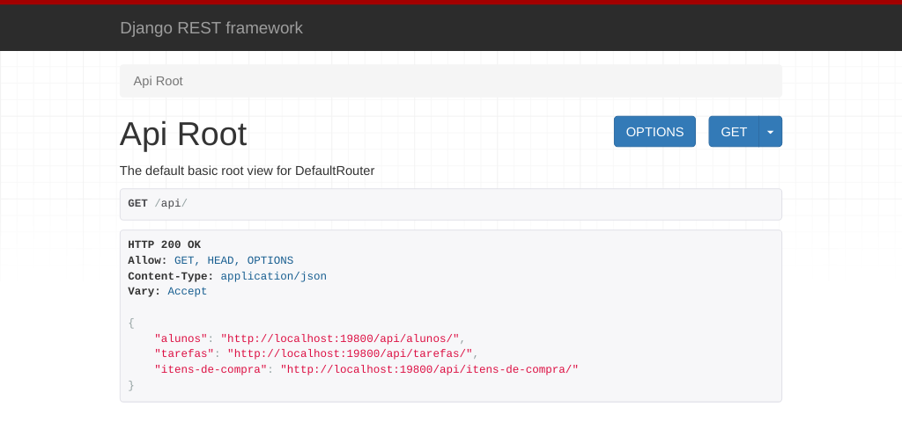
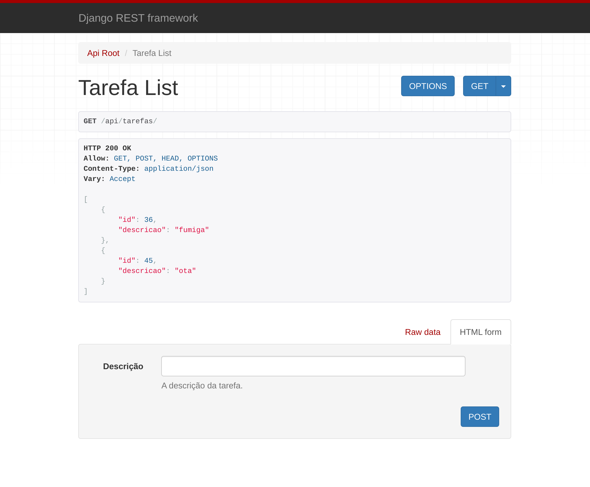
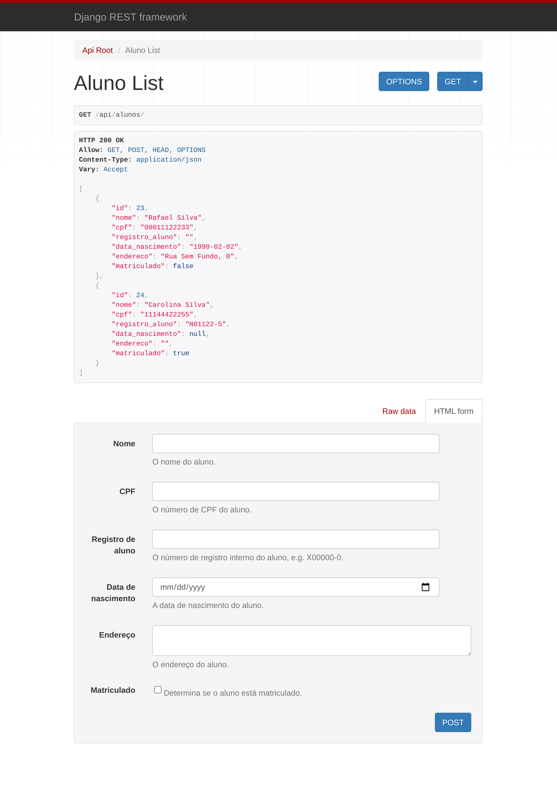
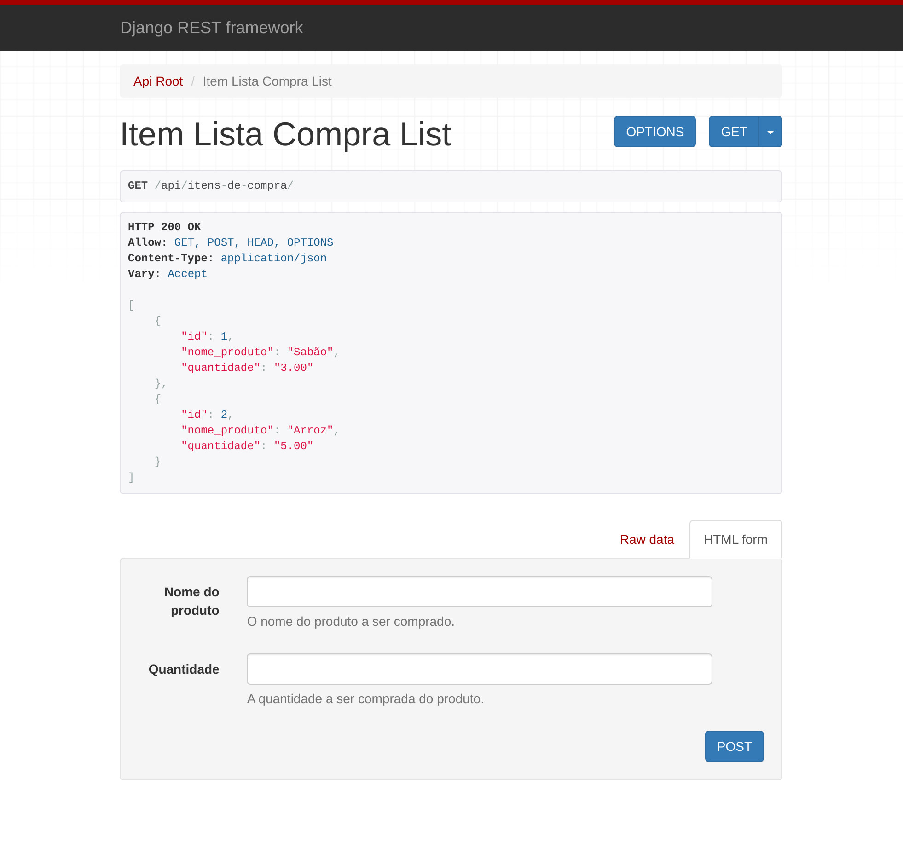

# Screenshots do back-end

Imagens capturadas utilizando o servidor de desenvolvimento do Django REST
Framework no ambiente local.

- Principais APIs do projeto:
  
- API de Tarefas:
  
- API de Alunos:
  
- API de Lista de Compras:
  
