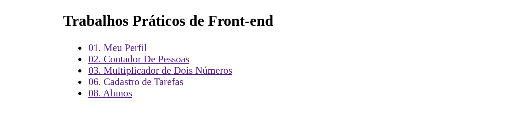
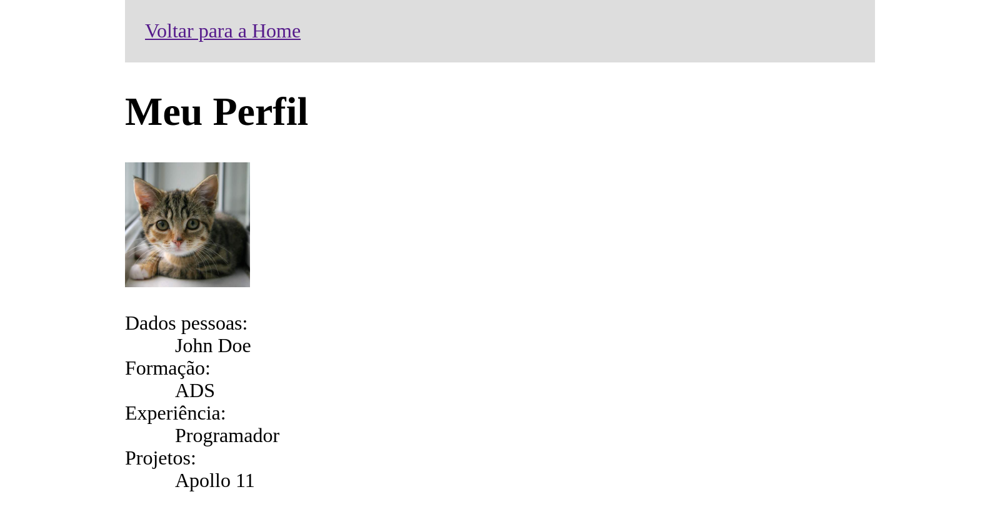
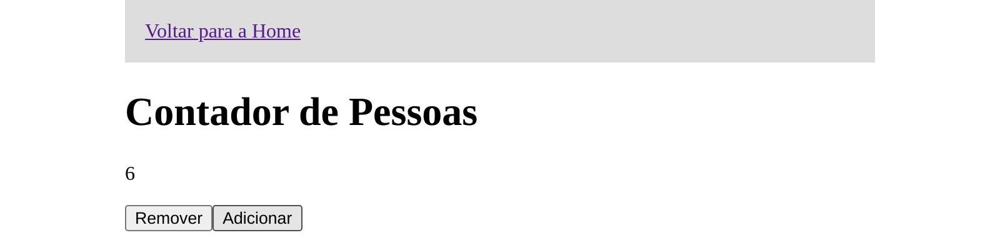
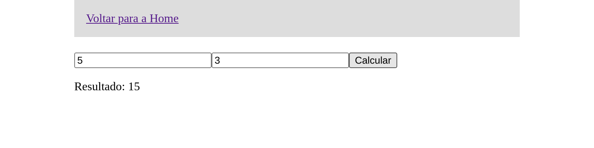
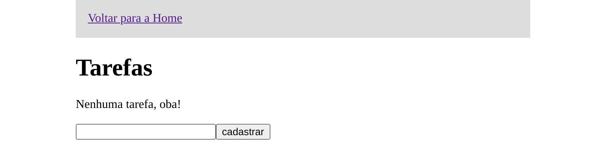
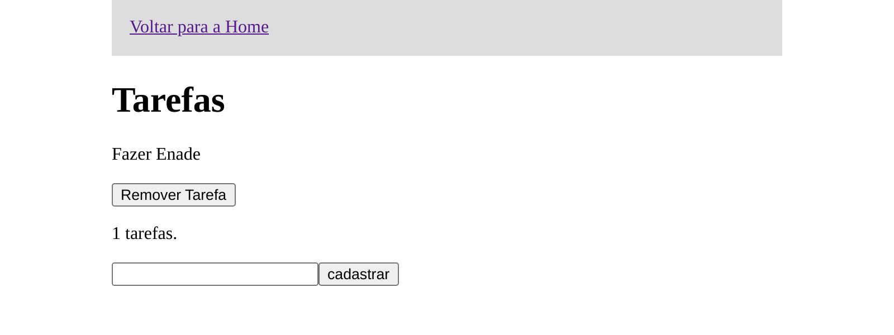
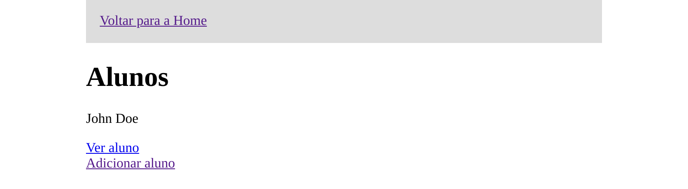
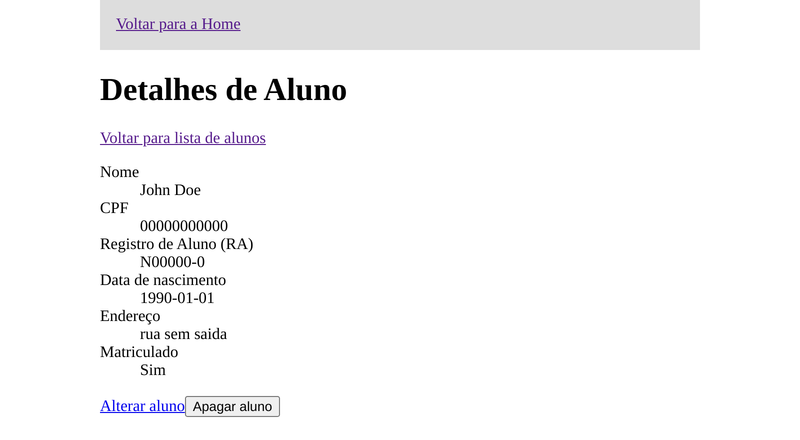

# Screenshots do front-end

Imagens capturadas utilizando o servidor de desenvolvimento do React no ambiente
local.

- Tela inicial:
  
- Meu perfil:
  
- Contador de pessoas:
  
- Calculadora de dois números:
  
- Tarefas:
  
  
- Alunos:
  
  
