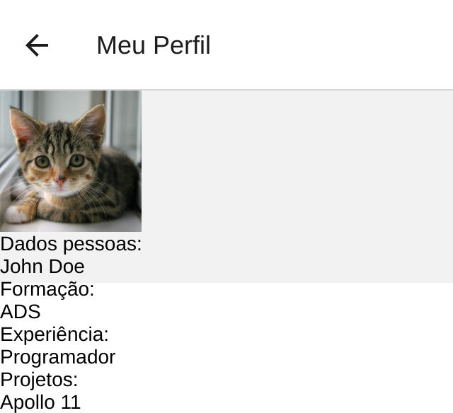

# Screenshots do back-end

Imagens capturadas utilizando o servidor de desenvolvimento do Expo no ambiente
local.

- Tela inicial
  
- Meu perfil
  
- Contador de pessoas
  
- Multiplicador de dois números
  
- Álcool ou gasolina
  
- Calculadora IMC
  
- Número aleatório
  
- Abertura de conta
  
- Anúncio de produtos
  
- Vagas de TI
  
- Conversor de moedas
  
- Abertura de conta (stack)
  
  
- Meu perfil (drawer)
  
  
  
  
- Preferências de usuário
  
  
- Tarefas
  
- Consulta de cep
  
- Perfil no GitHub
  
- Conversor de moedas (API)
  
- Lista de compras
  
- Filmes
  
  
- Alunos
  
  
